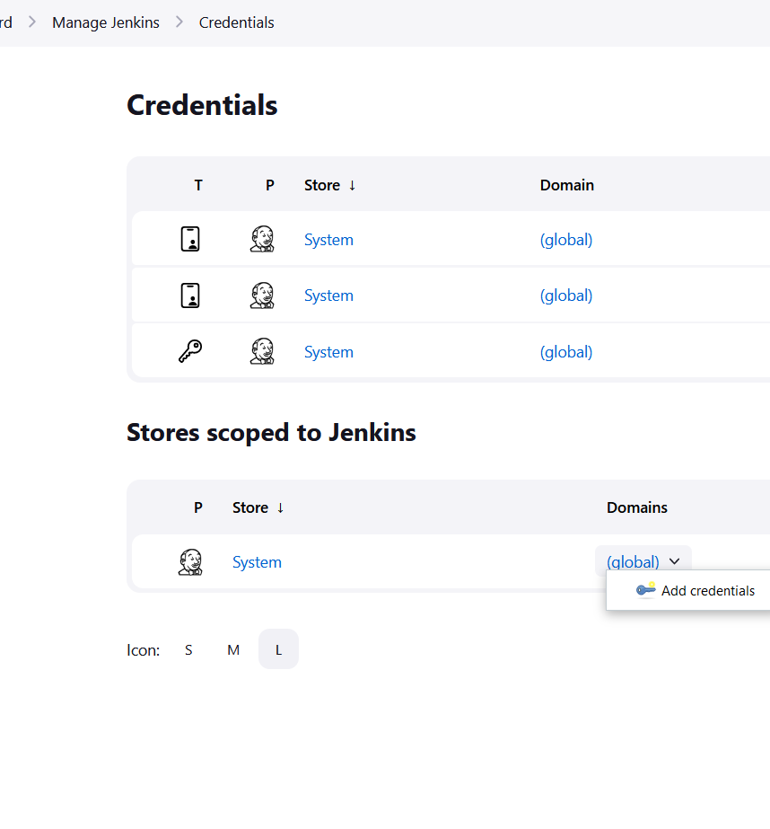
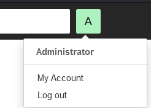
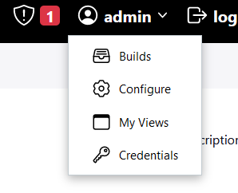

# Simple DevSecOps with Docker
A simple DevSecOps CI (Continuous Integration) pipeline based on the guide from OWASP. It uses Gitlab, SonarQube and Jenkins to automate the CI pipeline for a NodeJs App.  
The project contains a docker compose yaml file which setup the following containers:
  - Gitlab
  - jenkins-blueocean (custom jenkins image with blueocean plugin)
  - sonarQube
(Note: The Jenkins pipeline is missing container scanning at the moment.)

**This is meant to experiment with open source DevSecOps tools. Feel free to try it out** :wave:

Reference used for creating the pipeline: https://owasp.org/www-project-devsecops-guideline/latest/

## Getting Started
---
### Requirements
- Docker Compose V2
- Internet
- Lots of RAM (at least 16GB +)

### How to setup the pipeline 
1. Use the available scripts to start the docker-compose:
     - use the docker-compose-up.sh to start docker compose
       - command: ```sh docker-compose-up.sh```
     - use the docker-compose-up.sh to down docker compose (if containers need to be removed)
       - command: ```sh docker-compose-down.sh```
    
    *Note that it will take some time for the containers to startup (especially Gitlab container :disappointed:)

2. Setup the passwords for the following:
   - Jenkins: 
     - url: http://localhost:8080
     - find the initial password @ /var/jenkins_home/secrets/initialAdminPassword
       - goto the jenkins container > terminal
       - enter ```cat var/jenkins_home/secrets/initialAdminPassword``` to get the initial password
       - note: to select the pipeline and git plugins to download at startup
   - Sonarqube: 
     - url: http://localhost:9000
     - both initial username and password is "admin"
   - Gitlab
     - url: http://localhost:80
     - find the initial password @ etc/gitlab/initial_root_password
     - enter ```cat etc/gitlab/initial_root_password``` to get the initial password
     - username is "root"  
      
3. Download the necessary plugins for the pipeline @ Jenkins.
   - Goto Manage Jenkins > Manage Plugins
   - Download the following plugins and refresh the container after that
     - NodeJs Plugin
     - OWASP Dependency-Check Plugin
     - SonarQube Scanner for Jenkins
     - Git (if not downloaded yet)
     - Pipeline (if not downloaded yet)

4. Setup the credentials for Jenkins to connect to SonarQube and Gitlab
   - Goto Manage Jenkins > Manage Credentials
   - Click on the arrow button beside (global) > Add credentials

   - Create the following credentials 
     - Id: gitlab-creds
       - kind: username with password
       - enter the username (root for admin) and password created at gitlab
       - description: gitlab credentials
     - Id: sonarqube-creds
       - kind: secret text
       - description: authentication token for sonarqube
       - To get the access token from sonarqube 
         - click on the user icon > My account > Click on security tab  
         
         - choose "Global Analysis Token" type > set no expiration date  
          
5. Configure Jenkins
   - To setup connection to sonarqube
     - Goto Configure Jenkins > Configure System 
     - Under SonarQube servers, Click on "Add sonarqube" and add the following
       - Name: sonarqube
       - Server URL: http://sonarQube:9000 (sonarQube is the name of the sonarqube container)
       - Server authentication token: choose authentication token for sonarqube
   - Setup tools according to the following settings
     - Goto Configure Jenkins > Global Tools Configuration
       - NodeJS
         - Click on Add NodeJS
         - Name: NodeJS
         - [x] Install Automatically 
         - Choose the version to install
       - DependencyCheck
         - Click on Add Dependency Check 
         - Name: dependencyCheck
         - [x] Install Automatically 
         - Choose the version to install 
       - SonarQube Scanner
         - Click on Add SonarQube Scanner
         - Name: sonar-scanner
         - [x] Install automatically
         - Choose the version to install

6. Push your NodeJs code into Gitlab container
    - note that git remote url will look something like this if you are using localhost  
    ```http://host.docker.internal:80/gitlab-instance-****/repo-name.git```

7. Add the Jenkinsfile and sonar-project.properties files from the pipeline_AddOns folder to the repo
   - modify the sonar-project.properties file to suit the NodeJS project  

8. Create a pipeline item in Jenkins
    - Definition: Pipeline script from SCM
    - Repository url: http://gitlab/gitlab-instance-****/repo-name.git
    - Credentials: (choose the one with the gitlab credentials description)
    - Script Path (path to the jenkins file): Jenkins
      *Jenkins file can be renamed with .Jenkinsfile extension e.g. pipeline.Jenkinsfile  

9. Click on " > Build Now " to start the pipeline  
    *note that it will take some time for the tools to be installed in the Jenkins container initially

After the build job is completed, the dependency check results can be displayed in the job results. The sonarqube results can be viewed at http://localhost:9000. The Gitleaks results can be viewed in the console output (Use blueocean to view it).  

    
### Other settings
- Adjust the time zone for the timestamp in the console output
  - Click on the user > Configure  
  
  - Under User Defined Time Zone, select the timezone 
- Adjust the time displayed in the console output
  - Under Configure System > Timestamper
  - use the format ```'<b>'HH:mm:ss a'</b> '``` for ```hour:min:sec AM/PM```

## Pipeline explained
---
### Basic stages
The pipeline first goes through the usual stages:

1. git checkout
2. install node modules
3. build the app
4. run tests

### Scanning stages
The pipeline then goes through scanning stages for any vulnerabilities:  

5. Sonarqube for SAST/Static Application Security Testing 
   - test for vulnerabilities within code 

6. Dependency Check for SCA/Software Composition Analysis
   - scans for vulnerabilities in open source libraries that are used  

*Missing container and gitlaks scanning stages. Didn't have enough resources. :sob:

## Mini Notes
---
- Containers in a network should be reachable in the same network. So under the Jenkins settings, it is possible to use ```http://<sonarqube container name>:9000```
- Declare the name of the tools is important as they are used in the Jenkins pipeline file
- Inital usernames and passwords could have been added in the docker files